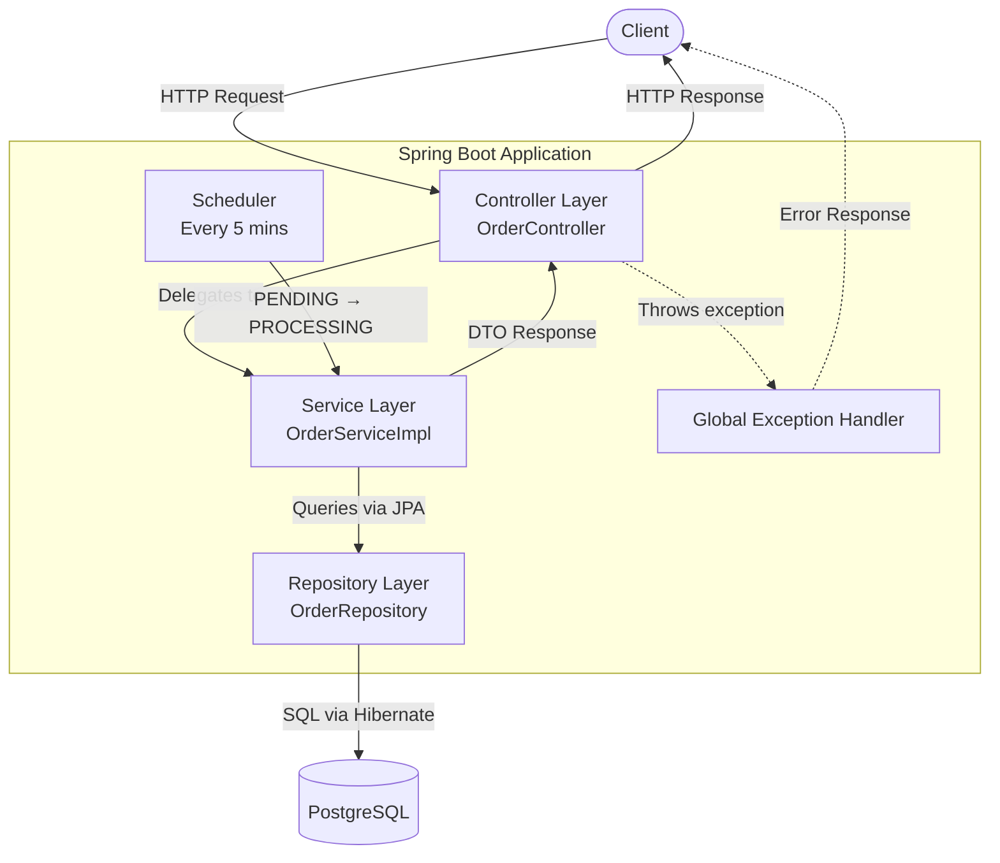
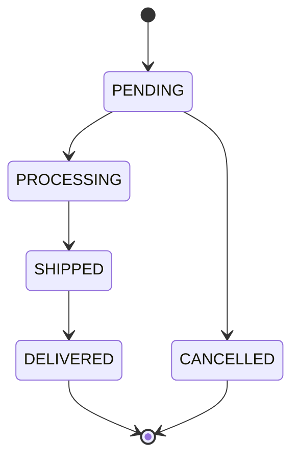

# OrderFlow

**Order Processing System** — A production-ready backend REST API built with Spring Boot 3 to manage the complete lifecycle of e-commerce orders, from creation through delivery.

---

## Table of Contents

1. [Project Overview](#1-project-overview)
2. [Features](#2-features)
3. [Technology Stack](#3-technology-stack)
4. [Architecture](#4-architecture)
5. [Project Structure](#5-project-structure)
6. [Database Design](#6-database-design)
7. [API Documentation](#7-api-documentation)
8. [Background Scheduler](#8-background-scheduler)
9. [Exception Handling](#9-exception-handling)
10. [Validation Rules](#10-validation-rules)
11. [Testing](#11-testing)
12. [Local Setup](#12-local-setup)
13. [Docker Setup](#13-docker-setup)
14. [Configuration](#14-configuration)
15. [Future Enhancements](#15-future-enhancements)
16. [AI Assistance Disclosure](#16-ai-assistance-disclosure)

---

## 1. Project Overview

OrderFlow is a backend service designed to handle the full order lifecycle in an e-commerce platform. It provides RESTful APIs for creating orders, tracking their status, and managing their progression through a defined workflow — from placement to delivery.

**Problem it solves:**
In an e-commerce system, orders need to follow a strict workflow to ensure consistency — a shipped order cannot go back to pending, and a delivered order cannot be cancelled. OrderFlow enforces these rules at the service layer and automates routine processing through a background scheduler.

**Key objectives:**
- Accept orders with multiple line items and auto-calculate totals
- Enforce a strict, validated status transition lifecycle
- Provide paginated, filterable order listing
- Automatically progress pending orders to processing every 5 minutes
- Return consistent, structured error responses for all failure scenarios

---

## 2. Features

### Order Creation
- Create an order with one or more line items
- Each item carries product name, quantity, and unit price
- Total amount is calculated automatically: `sum(price × quantity)`
- Every new order is assigned `PENDING` status by default
- Full request validation before any persistence

### Order Retrieval
- Fetch a single order by ID with all its line items
- Uses an optimized `JOIN FETCH` JPQL query to avoid N+1 issues

### Order Listing
- Retrieve all orders with support for:
  - **Pagination** — `?page=0&size=10`
  - **Sorting** — `?sort=createdAt,desc`
  - **Status filter** — `?status=PENDING`
- Returns a structured paged response with metadata

### Order Status Management
Orders move through the following statuses:

| Status | Description |
|---|---|
| `PENDING` | Order placed, awaiting processing |
| `PROCESSING` | Order is being prepared |
| `SHIPPED` | Order has been dispatched |
| `DELIVERED` | Order successfully delivered |
| `CANCELLED` | Order was cancelled |

**Valid transitions only:**
```
PENDING     →  PROCESSING
PENDING     →  CANCELLED
PROCESSING  →  SHIPPED
SHIPPED     →  DELIVERED
```
Any other transition is rejected with a `400 Bad Request`.

### Order Cancellation
- Dedicated cancel endpoint separate from status update
- Only `PENDING` orders can be cancelled
- Any other status returns `409 Conflict` with a descriptive message

### Automated Background Processing
- A Spring `@Scheduled` job runs every 5 minutes
- Finds all `PENDING` orders and moves them to `PROCESSING`
- Fully logged for observability

---

## 3. Technology Stack

| Category | Technology |
|---|---|
| Language | Java 17 |
| Framework | Spring Boot 3.2 |
| Web | Spring MVC (REST) |
| Persistence | Spring Data JPA + Hibernate 6 |
| Database | PostgreSQL 15 |
| Build | Maven 3.9 |
| Utilities | Lombok |
| Unit Testing | JUnit 5 + Mockito |
| API Testing | MockMvc |
| Test Database | H2 (in-memory, test scope) |
| Containerization | Docker + Docker Compose |

---

## 4. Architecture

### Application Flow



### Order Status Flow



### Layer Responsibilities

**Controller Layer** — Receives HTTP requests, triggers bean validation, delegates to service, returns HTTP responses. No business logic lives here.

**Service Layer** — Contains all business logic: total calculation, status transition validation, cancellation rules. Maps between entities and DTOs.

**Repository Layer** — Extends `JpaRepository`. Provides pagination, status-based filtering, and a custom `JOIN FETCH` query for loading orders with items in a single query.

---

## 5. Project Structure

```
src/main/java/com/ecommerce/orderprocessing/
│
├── OrderProcessingSystemApplication.java   Entry point
│
├── config/
│   └── SchedulerConfig.java               Enables @Scheduled
│
├── controller/
│   └── OrderController.java               All REST endpoints
│
├── dto/
│   ├── CreateOrderRequest.java            Inbound: create order
│   ├── OrderItemRequest.java              Inbound: line item
│   ├── UpdateStatusRequest.java           Inbound: status update
│   ├── OrderResponse.java                 Outbound: order details
│   ├── OrderItemResponse.java             Outbound: line item
│   ├── PagedResponse.java                 Outbound: paginated list
│   └── ErrorResponse.java                Outbound: error format
│
├── entity/
│   ├── Order.java                         orders table
│   ├── OrderItem.java                     order_items table
│   └── OrderStatus.java                   Status enum
│
├── exception/
│   ├── GlobalExceptionHandler.java        @RestControllerAdvice
│   ├── OrderNotFoundException.java
│   ├── InvalidStatusTransitionException.java
│   └── OrderCancellationException.java
│
├── repository/
│   ├── OrderRepository.java               JPA + custom JPQL
│   └── OrderItemRepository.java
│
├── scheduler/
│   └── OrderStatusScheduler.java          Cron job
│
└── service/
    ├── OrderService.java                  Interface
    └── impl/
        └── OrderServiceImpl.java          Business logic
```

---

## 6. Database Design

### Entity Relationship

```
orders
───────────────────────────────
id            BIGSERIAL  (PK)
customer_id   BIGINT
total_amount  NUMERIC(15,2)
status        VARCHAR(20)
created_at    TIMESTAMP
updated_at    TIMESTAMP
        │
        │ One-to-Many
        ▼
order_items
───────────────────────────────
id            BIGSERIAL  (PK)
product_name  VARCHAR
quantity      INTEGER
price         NUMERIC(15,2)
order_id      BIGINT  (FK → orders.id)
```

**Relationship:** One `Order` contains many `OrderItems`. Hibernate cascades all operations — saving an order automatically saves its items.

Tables are auto-created by Hibernate on startup (`ddl-auto: update`).

---

## 7. API Documentation

### Base URL
```
http://localhost:8080/api/orders
```

---

### POST /api/orders — Create Order

**Request Body:**
```json
{
  "customerId": 1001,
  "items": [
    { "productName": "Laptop", "quantity": 1, "price": 70000 },
    { "productName": "Mouse",  "quantity": 2, "price": 1000  }
  ]
}
```

**Response — 201 Created:**
```json
{
  "orderId": 1,
  "customerId": 1001,
  "totalAmount": 72000.00,
  "status": "PENDING",
  "createdAt": "2024-01-15T10:30:00",
  "items": [
    { "id": 1, "productName": "Laptop", "quantity": 1, "price": 70000.00 },
    { "id": 2, "productName": "Mouse",  "quantity": 2, "price": 1000.00  }
  ]
}
```

| Status Code | Scenario |
|---|---|
| 201 | Order created successfully |
| 400 | Validation failure (missing fields, invalid values) |

---

### GET /api/orders/{id} — Get Order by ID

**Response — 200 OK:** Same structure as create response above.

| Status Code | Scenario |
|---|---|
| 200 | Order found |
| 404 | Order not found |

---

### GET /api/orders — Get All Orders

```bash
# Default (page 0, size 10, sorted by createdAt DESC)
GET /api/orders

# With pagination and sorting
GET /api/orders?page=0&size=5&sort=createdAt,desc

# Filter by status
GET /api/orders?status=PENDING
```

**Response — 200 OK:**
```json
{
  "content": [ { "orderId": 1, "status": "PENDING", "..." : "..." } ],
  "page": 0,
  "size": 10,
  "totalElements": 25,
  "totalPages": 3,
  "last": false
}
```

---

### PUT /api/orders/{id}/status — Update Order Status

**Request Body:**
```json
{ "status": "PROCESSING" }
```

**Response — 200 OK:** Updated order object.

| Status Code | Scenario |
|---|---|
| 200 | Status updated |
| 400 | Invalid status transition |
| 404 | Order not found |

---

### PUT /api/orders/{id}/cancel — Cancel Order

No request body required.

**Response — 200 OK:** Order with `"status": "CANCELLED"`.

| Status Code | Scenario |
|---|---|
| 200 | Order cancelled |
| 404 | Order not found |
| 409 | Order is not in PENDING status |

---

## 8. Background Scheduler

The `OrderStatusScheduler` runs automatically every 5 minutes using Spring's `@Scheduled` annotation with the cron expression `0 */5 * * * *`.

**What it does:**
1. Queries the database for all orders with `status = PENDING`
2. Updates each order's status to `PROCESSING`
3. Persists all changes in a single batch via `saveAll()`
4. Logs the count of orders processed

**Why it exists:**  
In a real e-commerce platform, order fulfilment systems pick up new orders on a schedule. This scheduler simulates that behaviour — orders are not immediately processed the moment they are placed; they wait for the next processing cycle.

```java
@Scheduled(cron = "0 */5 * * * *")
public void processPendingOrders() {
    // Fires at :00, :05, :10, :15 ... of every hour
}
```

---

## 9. Exception Handling

All exceptions are handled centrally by `GlobalExceptionHandler` (`@RestControllerAdvice`). Every error returns the same JSON structure:

```json
{
  "timestamp": "2024-01-15T10:30:00",
  "message": "Order not found with id: 99",
  "status": 404
}
```

| Exception | HTTP Status | Trigger |
|---|---|---|
| `OrderNotFoundException` | 404 Not Found | Order ID does not exist |
| `InvalidStatusTransitionException` | 400 Bad Request | Transition not in allowed map |
| `OrderCancellationException` | 409 Conflict | Cancel on non-PENDING order |
| `MethodArgumentNotValidException` | 400 Bad Request | Bean validation failure |
| `NoResourceFoundException` | 404 Not Found | Unknown endpoint called |
| `Exception` (catch-all) | 500 Internal Server Error | Unexpected runtime error |

---

## 10. Validation Rules

Validated automatically via Jakarta Bean Validation (`@Valid`) before the request reaches service logic.

| Field | Rule |
|---|---|
| `customerId` | Required — must not be null |
| `items` | Required — must contain at least one item |
| `productName` | Required — must not be blank |
| `quantity` | Required — must be ≥ 1 |
| `price` | Required — must be ≥ 0.01 |

Violations return `400 Bad Request` with a message listing all failed constraints.

---

## 11. Testing

### Unit Tests — `OrderServiceTest`

Tests service-layer business logic using **JUnit 5 + Mockito** (no database required).

Scenarios covered:
- Order creation with correct total calculation
- Order retrieval — found and not-found cases
- Valid status transitions (PENDING→PROCESSING, PROCESSING→SHIPPED)
- Invalid transition throws `InvalidStatusTransitionException`
- Cancel PENDING order — success
- Cancel non-PENDING order — throws `OrderCancellationException`
- Scheduler moves PENDING orders to PROCESSING
- Scheduler does nothing when no PENDING orders exist
- Paginated list with and without status filter

### API Tests — `OrderControllerTest`

Tests the full HTTP layer using **MockMvc** (Spring context, mocked service).

Scenarios covered:
- `POST /api/orders` — happy path returns 201
- `POST /api/orders` — missing `customerId` returns 400
- `POST /api/orders` — empty items list returns 400
- `GET /api/orders/{id}` — found returns 200
- `GET /api/orders/{id}` — not found returns 404
- `PUT /api/orders/{id}/cancel` — success returns 200
- `PUT /api/orders/{id}/cancel` — non-PENDING returns 409
- `GET /api/orders` — paginated list returns 200
- `GET /api/orders?status=PENDING` — filtered list returns 200

---

## 12. Local Setup

### Prerequisites

| Tool | Version |
|---|---|
| Java | 17+ |
| Maven | 3.9+ |
| PostgreSQL | 15+ |
| Docker | Optional |

### Steps

```bash
# 1. Clone the repository
git clone https://github.com/ShashankJack1991/order-processing-system.git
cd order-processing-system

# 2. Create the database
psql -U postgres -c "CREATE DATABASE orderdb;"

# 3. Build
mvn clean install

# 4. Run
mvn spring-boot:run
```

Application starts at: **http://localhost:8080**

---

## 13. Docker Setup

No local PostgreSQL installation needed.

```bash
# Build and start both services
docker-compose up --build
```

This starts:
- **Spring Boot app** on port `8080`
- **PostgreSQL 15** on port `5432`

The app waits for the database health check to pass before starting.

```bash
# Stop and remove containers
docker-compose down

# Stop and also wipe the database volume
docker-compose down -v
```

---

## 14. Configuration

All configuration is in `src/main/resources/application.yml`.

```yaml
server:
  port: 8080

spring:
  datasource:
    url: jdbc:postgresql://localhost:5432/orderdb
    username: postgres
    password: postgres

  jpa:
    hibernate:
      ddl-auto: update        # Auto-creates/updates tables on startup
    defer-datasource-initialization: true  # Ensures data.sql runs after DDL
    show-sql: true

  sql:
    init:
      mode: always            # Runs data.sql on every startup
```

To change database credentials, update the `datasource` section above.

---

## 15. Future Enhancements

| Enhancement | Description |
|---|---|
| JWT Authentication | Secure APIs with token-based auth |
| Role-based Access | Admin vs customer permissions |
| Redis Caching | Cache frequently read orders to reduce DB load |
| Kafka Integration | Event-driven order status updates |
| Inventory Service | Validate stock before confirming an order |
| Payment Integration | Link orders to payment gateway transactions |
| Actuator + Prometheus | Health checks and metrics endpoint |
| Distributed Tracing | Add trace IDs across service calls (Micrometer/Zipkin) |
| API Rate Limiting | Protect endpoints from abuse |

---

## 16. AI Assistance Disclosure

This project was developed with the assistance of **Claude (Anthropic)** as a coding productivity tool.

**Where AI was used:**
- Initial project scaffolding and Maven configuration
- Boilerplate generation for entity, DTO, and repository classes
- Writing JUnit and MockMvc test cases

**Manual work and review:**
- Architecture decisions (layer responsibilities, DTO pattern, transition logic)
- Business rule design (status transition map using `EnumMap`)
- Bug identification and fixes:
  - Added `@Param("id")` to the JPQL named parameter in `OrderRepository`
  - Fixed `@WebMvcTest` to not include `@RestControllerAdvice` in the controllers list
  - Added `defer-datasource-initialization: true` to fix `data.sql` timing with Hibernate DDL
- Code review and validation of all generated output
- Integration testing and final verification

AI was used as a tool to accelerate development — all design decisions, review, and correctness verification were done manually.
